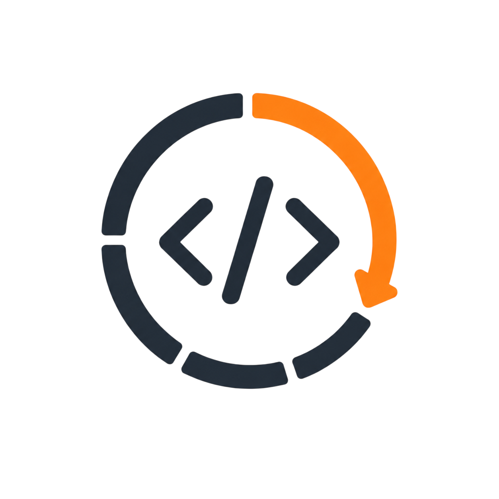

<p align="center">
  
</p>

<h1 align="center">
  Contributing to Codex Limits
</h1>

<p align="center">
    Guidelines for contributing to <strong>codex-limits</strong>.
</p>

<p align="center">
    
    
    
    
    
</p>

Read [`README.md`](README.md) first, then use the [documentation hub](docs/README.md) to find the canonical guide for the area you plan to change.

## Contents

- [Quick start](#quick-start)
- [Branch naming](#branch-naming)
- [Issues](#issues)
- [Local development](#local-development)
- [Code guidelines](#code-guidelines)
- [Safety rules](#safety-rules)
- [Adding a new agent](#adding-a-new-agent)
- [Documentation changes](#documentation-changes)
- [Pull request checklist](#pull-request-checklist)
- [Security policy](#security-policy)
- [Community guidelines](#community-guidelines)
- [Contact](#contact)

## Quick start

If you are new to the project, read [`README.md`](README.md) and the [documentation hub](docs/README.md), then choose one focused issue or improvement.

| Step | Action                                          |
| ---- | ----------------------------------------------- |
| 1    | Fork the repository.                            |
| 2    | Create a branch from `main`.                    |
| 3    | Make one focused change.                        |
| 4    | Run the local checks.                           |
| 5    | Open a Pull Request with context and rationale. |

## Branch naming

| Type        | Pattern  | Example                     |
| ----------- | -------- | --------------------------- |
| Feature     | `feat/`  | `feat/add-agent-adapter`    |
| Bug fix     | `fix/`   | `fix/usage-window-reset`    |
| Docs        | `docs/`  | `docs/update-agent-guide`   |
| Maintenance | `chore/` | `chore/update-build-config` |
| Tests       | `test/`  | `test/add-coupon-coverage`  |

## Issues

Before opening a new issue, check existing [Issues](https://github.com/simonesiega/codex-limits/issues) to avoid duplicates.

Please include:

| Field               | Why it matters                                           |
| ------------------- | -------------------------------------------------------- |
| Expected behavior   | Explains what should happen.                             |
| Actual behavior     | Shows what currently happens.                            |
| Reproduction steps  | Makes the issue easier to verify.                        |
| Environment         | Helps isolate OS, Node, Bun, or Codex-specific behavior. |
| Logs or screenshots | Clarifies terminal, CLI, or agent output.                |

For architecture-level changes, open an issue first so the design can be discussed before implementation.

## Local development

### Requirements

Before starting development, read the project [Requirements](README.md#requirements) and make sure your environment meets them. Development also requires [Bun](https://bun.sh/) using the version declared in `package.json`, because this repository uses Bun for dependency management, scripts, builds, and tests.

Install dependencies:

```bash
bun install
```

Run the CLI locally:

```bash
bun run dev
```

Run the full validation pipeline (format verification, documentation checks, types, tests, production builds, and packed-artifact smoke checks):

```bash
bun run check
```

Run all documentation checks:

```bash
bun run docs:check
```

Run the documentation checks individually:

```bash
bun run docs:link
bun run docs:schema
```

Run tests only:

```bash
bun test
```

Build the package:

```bash
bun run build
```

## Code guidelines

Keep changes small, readable, and easy to review.

| Area               | Guideline                                                                                         |
| ------------------ | ------------------------------------------------------------------------------------------------- |
| Core logic         | Keep usage detection, normalization, and safety rules inside `src/package/core`.                  |
| CLI commands       | Add commands through the shared registry and parser; keep handlers focused and capability-scoped. |
| Terminal UI        | Keep Ink rendering inside `src/package/tui`; components should receive display-ready data.        |
| Agent integrations | Keep adapters thin and reuse the shared core instead of reimplementing Codex limit parsing.       |
| Tests              | Add or update tests when behavior, safety rules, or output formatting changes.                    |

When adding a CLI command, create a focused command module and register it in `src/package/commands/command-registry.ts`. Put names, descriptions, usage, options, positional arguments, conflicts, and safety classification in that command definition so the shared parser and help generator stay synchronized. Command factories should accept only the runtime capabilities their handlers use.

## Safety rules

`codex-limits` treats local Codex data as read-only and should remain safe by default.

Do not print, log, snapshot, or commit:

- access tokens;
- account IDs;
- auth headers;
- cookies;
- raw local Codex files;
- private environment values.

If a change touches local data discovery, live coupon data, warnings, output formatting, or agent integrations, make sure sensitive values are redacted before they can reach the CLI, TUI, JSON output, tests, or screenshots.

Command handlers should let the router replace unexpected exceptions with their fixed command failure message. Use `AgentInstallError` only for bounded, deliberately user-safe adapter messages; never pass through a raw filesystem, network, or credential error.

## Adding a new agent

New agents should use the same small adapter shape as [`src/agents/opencode`](src/agents/opencode), [`src/agents/pi`](src/agents/pi), and [`src/agents/copilot`](src/agents/copilot): `format.ts`, `install.ts`, `integration.ts`, and `plugin.ts`. Put reusable presentation and safe configuration behavior in `src/agents/shared`.

| Step | Action                                                                                                                          |
| ---- | ------------------------------------------------------------------------------------------------------------------------------- |
| 1    | Create `src/agents/<agent-name>` with the standard four-file adapter layout.                                                    |
| 2    | Define metadata, optional environment help, `install`, and `inspect` in `integration.ts`.                                       |
| 3    | Keep `plugin.ts` focused on the target host API and load Codex data only through the shared package core.                       |
| 4    | Register the integration descriptor once in `src/agents/index.ts`; shared install and doctor commands consume it automatically. |
| 5    | Add installer, formatter, and host-behavior tests. When end-to-end automation is impractical, document the manual validation.   |
| 6    | Add `docs/readme/agents/<agent-name>.md`.                                                                                       |
| 7    | Add the integration to [Agent Integrations](docs/readme/agent-integrations.md).                                                 |
| 8    | Update the README supported-agent summary and any target-specific package/build metadata.                                       |
| 9    | Add or update screenshots when the visual output changes.                                                                       |
| 10   | Run the documentation link and schema checks.                                                                                   |

The goal of every integration is the same: show Codex limit information quickly, safely, and without sending unnecessary work to the LLM.

## Documentation changes

Task-oriented guides live under [`docs/`](docs/README.md), and visual assets live under [`docs/photos/`](docs/photos/). Update the canonical guide whenever behavior, setup, compatibility, output, or safety guarantees change; avoid copying complete procedures into multiple files.

Keep documentation changes consistent with these rules:

- use relative links for files in this repository;
- keep commands executable from their documented working directory;
- keep heading anchors stable when another file links to them;
- synchronize JSON examples with `docs/schema/codex-limits.schema.json`;
- use descriptive image alt text and sanitized screenshots;
- never include tokens, account IDs, cookies, authorization headers, private paths, environment contents, or raw Codex files.

Run:

```bash
bun run docs:check
git diff --check
```

Documentation-only changes do not require unrelated runtime changes, but the complete `bun run check` remains the final repository gate before release.

## Pull request checklist

Before requesting review, verify:

- [ ] The PR title and description explain what changed and why.
- [ ] The change is focused and does not include unrelated cleanup.
- [ ] `bun run format` was run and `bun run check` passes locally.
- [ ] Tests were added or updated for behavior changes.
- [ ] Documentation was updated if commands, setup, output, or agent support changed.
- [ ] No secrets, account data, tokens, cookies, or raw local files were committed.
- [ ] Screenshots were updated only when the visual output changed.

## Security policy

If you discover a vulnerability or a way to expose private Codex data, do not open a public issue.

Please follow the private reporting process in [`SECURITY.md`](./SECURITY.md).

## Community guidelines

Be clear, respectful, and constructive in issues, Pull Requests, and reviews. Good contributions are focused, tested, documented, and easy to understand.

## Contact

For direct contact:

- Email: [simonesiega1@gmail.com](mailto:simonesiega1@gmail.com)
- GitHub: [@simonesiega](https://github.com/simonesiega)

Thanks for contributing to **`codex-limits`**.
