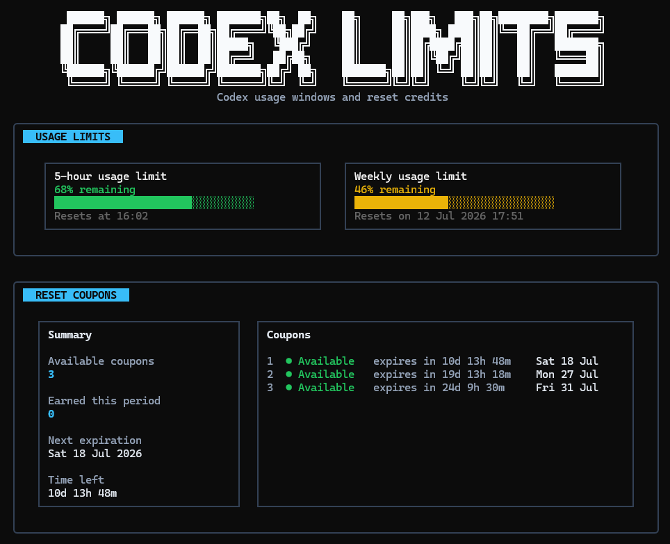

<h1 align="center">
  
  <br />
  Codex Limits
</h1>

<p align="center">
  A polished terminal dashboard for checking Codex usage limits, reset times, and reset-credit coupons.
</p>

<p align="center">
  <a href="https://github.com/simonesiega/codex-limits/stargazers"></a>
  <a href="https://github.com/simonesiega/codex-limits/issues"></a>
  <a href="https://github.com/simonesiega/codex-limits/pulls"></a>
  <a href="https://github.com/simonesiega/codex-limits/commits/main"></a>
  <a href="LICENSE"></a>
</p>

<p align="center">
  
  
  
</p>

## Final result 🚀

<p align="center">
  
</p>

The screenshot shows the final **`codex-limits`** terminal dashboard: a clean, read-only TUI that summarizes Codex usage limits and reset-credit coupons in one place. The top section displays the current 5-hour and weekly usage windows with remaining percentages, visual progress bars, and reset times, while the lower section shows available reset coupons, their expiration dates, and the next coupon deadline.

## Quick start

The package is available on npm as [`@simonesiega/codex-limits`](https://www.npmjs.com/package/@simonesiega/codex-limits).

Install **`codex-limits`** globally from npm:

```bash
npm install -g @simonesiega/codex-limits@latest
```

The `@latest` tag ensures you install the latest published version.

Then run it from any terminal:

```bash
codex-limits
```

The list of available commands is shown when you run `codex-limits --help` or in the [Usage](#usage) section.

Install optional agent integrations:

```bash
codex-limits init <agent-name>
```

For example, install the OpenCode integration:

```bash
codex-limits init --opencode
```

## Overview

When you are working with Codex or agent-based coding tools, usage limits can interrupt your flow if you do not know what is left or when the next reset happens.

**`codex-limits`** gives you that information in one clean terminal view. It shows your current 5-hour and weekly usage windows, remaining percentages, progress bars, reset times, and reset-credit coupons when available, so you can quickly check your status and continue coding without leaving the terminal.

It also includes plain-text commands for quick checks, JSON output for scripts and automation, optional agent integrations through `codex-limits init`, and safe output that never prints tokens, account IDs, auth headers, cookies, or raw local files.

## Agent integrations

### Supported agents

| Agent | Status | Agent command | Init command | Description |
| --- | --- | --- | --- | --- |
| OpenCode | Supported | `/codex-limits` | `codex-limits init --opencode` | Opens a fast, read-only Codex limits dashboard directly inside OpenCode without sending the request to the LLM. |

Agent integrations are not enabled automatically during package installation. The package export is reserved for agent plugin entries that supported agents load after you run the matching `codex-limits init` command.

### Selected agent integration screenshots

#### OpenCode
The OpenCode integration adds a `/codex-limits` command that opens a compact modal inside the agent interface. It gives a quick read-only summary of the current 5-hour limit, weekly limit, and reset-credit coupons, then lets you close the view and return immediately to the conversation.

<p align="center">
  
</p>

### Adding new agents

New agents can be added by creating a dedicated adapter under `src/agents/<agent-name>` and registering it in `src/agents/index.ts`. Each integration should keep the same goal: show Codex limit information quickly, safely, and without exposing tokens, account IDs, cookies, auth headers, or raw local files.

See the [Contributing](./CONTRIBUTING.md) guide if you want to add support for another agent.

## How it works

**`codex-limits`** is built around a shared core with different output surfaces on top of it.

| Area | Path | Purpose |
| --- | --- | --- |
| CLI entry | `src/package/cli.ts` | Starts the `codex-limits` command and routes to the dashboard, plain-text commands, JSON output, and `init`. |
| Core logic | `src/package/core` | Detects Codex data, reads local usage, fetches optional live information, normalizes usage windows, and keeps sensitive values out of the output. |
| CLI commands | `src/package/commands` | Handles the dashboard, `status`, `coupons`, `--json`, and `init` commands. |
| Terminal UI | `src/package/tui` | Renders the clean Ink-based dashboard from normalized usage data. |
| Agent integrations | `src/agents` | Contains optional coding-agent adapters that users install with `codex-limits init`. |
| Tests | `tests` | Contains the test suite used to validate core behavior, CLI output, safety rules, and integration logic. |

This structure keeps the project easy to extend: the core decides what the data means, while the CLI, TUI, and agents only decide how that information is shown.

## Environment

**`codex-limits`** works out of the box when it can find the required Codex data automatically. By default, it tries to detect the local Codex data directory and discover the information needed to show usage limits and reset-credit coupons. Most users do not need to configure anything manually.

Environment variables are only used as a fallback when automatic discovery is not enough, or when you want to override the default behavior.

| Variable | Purpose |
| --- | --- |
| `CODEX_LIMITS_HOME` | Manually sets the local Codex data directory when it cannot be detected automatically. |
| `CODEX_LIMITS_ACCESS_TOKEN` | Manually provides an access token for live reset-credit coupon data. |
| `CODEX_LIMITS_ACCOUNT_ID` | Manually provides the account ID used for live reset-credit coupon data. |
| `CODEX_LIMITS_USAGE_ENDPOINT` | Overrides the live usage endpoint, mainly for testing or advanced setups. |

## Usage

| Command | Description |
| --- | --- |
| `codex-limits` | Opens the interactive terminal dashboard. |
| `codex-limits status` | Prints a plain usage summary. |
| `codex-limits coupons` | Prints reset-credit coupon information. |
| `codex-limits --json` | Prints machine-readable usage data for scripts and automation. |
| `codex-limits init` | Installs optional agent integrations. |
| `codex-limits init --opencode` | Installs the OpenCode integration directly. |
| `codex-limits --help` | Prints the help text. |
| `codex-limits --version` | Prints the installed package version. |

## Local development

Clone the repository, install dependencies, and run the CLI locally:

```bash
bun install
bun run dev
```

Useful development commands:

| Command | Description |
| --- | --- |
| `bun run dev` | Runs the CLI in development mode. |
| `bun run check` | Runs type checking, tests, and build validation. |
| `bun test` | Runs the test suite. |
| `bun run build` | Builds the package. |

## Security

For vulnerability reports and local data safety details, see [`SECURITY.md`](./SECURITY.md).

## License

This project is licensed under the MIT License. See [`LICENSE`](LICENSE).

## Contributors 🧑‍💻

<p align="center">
  <a href="https://github.com/simonesiega/codex-limits/graphs/contributors">
    
  </a>
</p>
