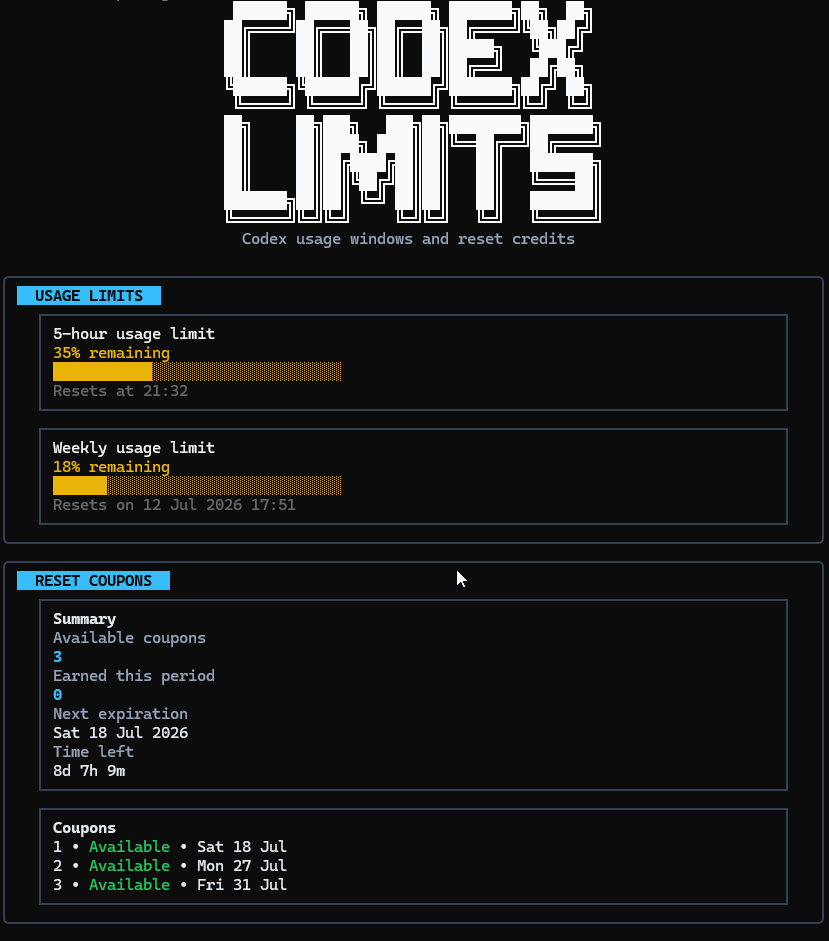
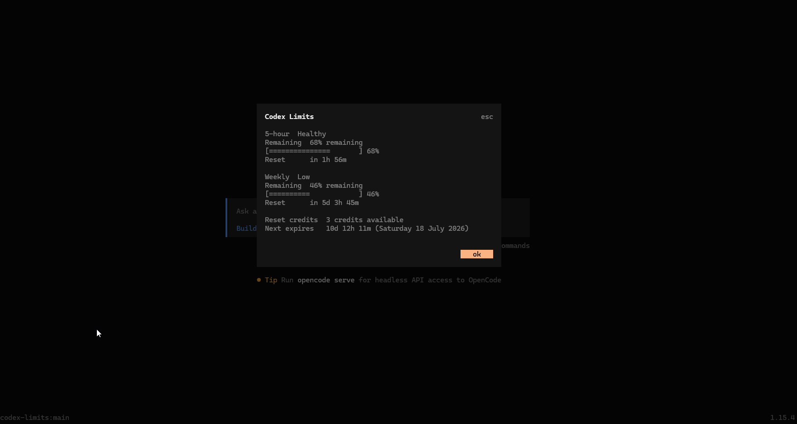
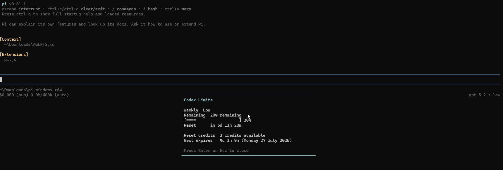
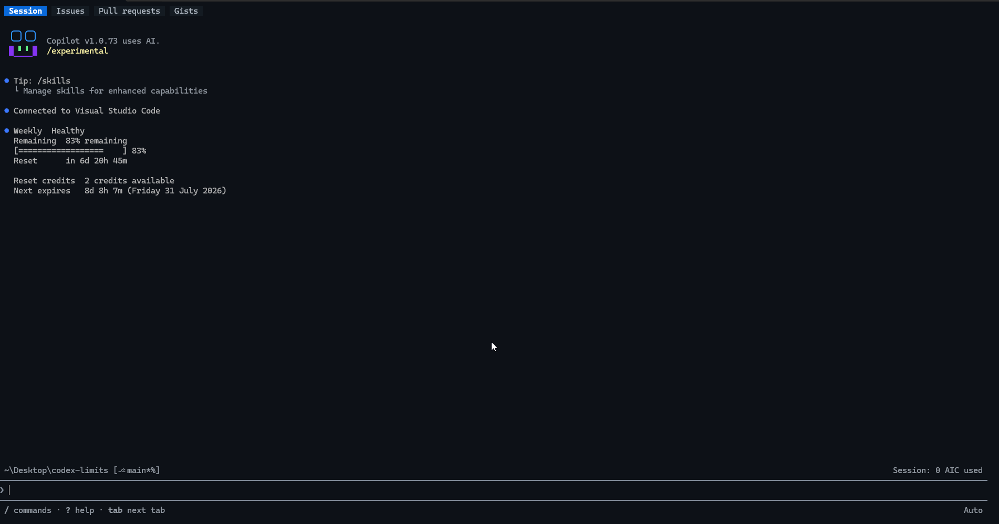

<h1 align="center">
  
</h1>

<p align="center">
  A polished terminal dashboard for checking Codex usage limits, reset times, and reset-credit coupons.
</p>

<p align="center">
  <a href="https://github.com/simonesiega/codex-limits/stargazers"></a>
  <a href="https://github.com/simonesiega/codex-limits/issues"></a>
  <a href="https://github.com/simonesiega/codex-limits/pulls"></a>
  <a href="https://github.com/simonesiega/codex-limits/commits/main"></a>
  <a href="LICENSE"></a>
</p>

<p align="center">
  
  
</p>

<p align="center">
  <a href="#local-development">
    
    
  </a>
</p>

## Preview 🚀

<p align="center">
  
  
</p>

The screenshots show the **`codex-limits`** terminal dashboards: clean, read-only TUIs that summarize Codex usage limits and reset-credit coupons in one place. The top section displays the usage windows currently supplied by Codex—weekly usage and, when available, the 5-hour window—with remaining percentages, visual progress bars, and reset times, while the lower section shows available reset coupons, their expiration dates, and the next coupon deadline.

## Contents

- [Quick start](#quick-start)
- [Requirements](#requirements)
- [Overview](#overview)
- [Agent integrations](#agent-integrations)
- [How it works](#how-it-works)
- [Environment](#environment)
- [Usage](#usage)
- [Troubleshooting](#troubleshooting)
- [Documentation](#documentation)
  - [Documentation hub](docs/README.md)
  - [JSON output](docs/readme/json-output.md)
  - [Agent integrations](docs/readme/agent-integrations.md)
  - [Compatibility](docs/readme/compatibility.md)
- [Local development](#local-development)
- [Security](#security)
- [License](#license)
- [Contributors](#contributors)

## Quick start

The package is available on npm as [`@simonesiega/codex-limits`](https://www.npmjs.com/package/@simonesiega/codex-limits) and supports Node.js 20 or newer.

Install **`codex-limits`** globally from npm:

```bash
npm install -g @simonesiega/codex-limits@latest
```

The `@latest` tag ensures you install the latest published version.

Then run it from any terminal:

```bash
codex-limits
```

The list of available commands is shown when you run `codex-limits --help` or in the [Usage](#usage) section.

Install an optional agent integration by name:

```bash
codex-limits agents install <agent-name>
```

For example, install the OpenCode, pi, or GitHub Copilot CLI integration:

```bash
codex-limits agents install opencode
codex-limits agents install pi
codex-limits agents install copilot
```

The existing `codex-limits init --<agent-name>` syntax remains supported as a compatibility command.

## Requirements

| Requirement         | Details                                                                                                                                                                                                           |
| ------------------- | ----------------------------------------------------------------------------------------------------------------------------------------------------------------------------------------------------------------- |
| Node.js             | Node.js 20 or newer is required to run the published CLI. Bun is only required for local development.                                                                                                             |
| Codex               | For normal use, Codex should already be installed and authenticated so `codex-limits` can discover its local data and credentials. Advanced setups can provide supported environment overrides instead.           |
| Operating systems   | Windows, macOS, and Linux are supported through their standard Codex data locations. Use `CODEX_LIMITS_HOME` or `CODEX_HOME` if your data is stored elsewhere.                                                    |
| Internet connection | Local usage fallback can work offline. An internet connection is required for current live usage and reset-credit coupon information; unavailable network data is reported safely without breaking the dashboard. |

The standalone CLI supports Node.js 20 and newer. The optional pi integration runs inside the pi host; pi 0.81.x requires Node.js 22.19 or newer. The GitHub Copilot CLI integration uses Copilot's experimental extension host and its CLI-provided SDK.

## Overview

When you are working with Codex or agent-based coding tools, usage limits can interrupt your flow if you do not know what is left or when the next reset happens.

**`codex-limits`** gives you that information in one clean terminal view. It shows the usage windows currently supplied by Codex, including weekly usage and the 5-hour window when available, together with remaining percentages, progress bars, reset times, and reset-credit coupons, so you can quickly check your status and continue coding without leaving the terminal.

It also includes plain-text commands for quick checks, an explicitly confirmed `codex-limits reset` action for using one reset coupon, a safe `codex-limits doctor` diagnostic report, JSON output for scripts and automation, optional agent integrations through `codex-limits agents`, and safe output that never prints tokens, account IDs, auth headers, cookies, private paths, or raw local files.

## Agent integrations

Optional integrations make Codex limit information available directly inside supported coding agents while reusing the same normalized read paths and safety model as the CLI. Agent integrations do not receive the reset command's mutation capability.

For installation details, adapter behavior, architecture, and contribution guidance, see the detailed [Agent integrations guide](docs/readme/agent-integrations.md).

### Supported agents

| Agent              | Status    | Agent command   | Guide                                                    | Description                                                                                                         |
| ------------------ | --------- | --------------- | -------------------------------------------------------- | ------------------------------------------------------------------------------------------------------------------- |
| OpenCode           | Supported | `/codex-limits` | [Installation and usage](docs/readme/agents/opencode.md) | Opens a fast, read-only Codex limits dashboard directly inside OpenCode without sending the request to the LLM.     |
| pi                 | Supported | `/codex-limits` | [Installation and usage](docs/readme/agents/pi.md)       | Opens a themed, read-only Codex limits overlay directly inside pi without sending the request to the LLM.           |
| GitHub Copilot CLI | Supported | `/codex-limits` | [Installation and usage](docs/readme/agents/copilot.md)  | Logs a compact, read-only Codex limits summary through a local Copilot CLI extension without sending it to the LLM. |

Agent integrations are not enabled automatically during package installation. They must be installed with `codex-limits agents install` (or the compatible `codex-limits init` syntax) and are only available in the agent terminal after a restart. See [Adding new agents](#adding-new-agents) if you want to add support for another agent.

### Selected agent integration screenshots

#### OpenCode

The OpenCode integration adds a `/codex-limits` command that opens a compact modal inside the agent interface. It gives a quick read-only summary of the available usage windows and reset-credit coupons, then lets you close the view and return immediately to the conversation.

<p align="center">
  
</p>

#### pi

The pi integration adds a `/codex-limits` command that opens a themed overlay inside the agent interface. It shows the same read-only usage windows and reset-credit summary without sending the request or limit data to the LLM.

<p align="center">
  
</p>

#### GitHub Copilot CLI

The GitHub Copilot CLI integration adds a `/codex-limits` command that displays a compact, read-only limits summary in the session timeline. It loads the shared core locally without sending the request or limit data to the LLM.

<p align="center">
  
</p>

### Adding new agents

New agents use the same four-file adapter layout under `src/agents/<agent-name>`: `format.ts`, `install.ts`, `integration.ts`, and `plugin.ts`. The integration descriptor owns its metadata, environment help, installer, and read-only diagnostic check; registering that descriptor in `src/agents/index.ts` automatically connects shared installation, compatibility help, and doctor diagnostics. Each integration should show Codex limit information quickly and safely without exposing tokens, account IDs, cookies, auth headers, or raw local files.

See the [Contributing](./CONTRIBUTING.md) guide if you want to add support for another agent.

## How it works

**`codex-limits`** is built around a shared core with different output surfaces on top of it.

| Area               | Path                   | Purpose                                                                                                                                    |
| ------------------ | ---------------------- | ------------------------------------------------------------------------------------------------------------------------------------------ |
| CLI entry          | `src/package/cli.ts`   | Starts the `codex-limits` command and delegates to the shared command registry.                                                            |
| Core logic         | `src/package/core`     | Detects Codex data, normalizes live and local information, performs confirmed coupon redemption, and keeps sensitive values out of output. |
| CLI commands       | `src/package/commands` | Defines command metadata, shared parsing and help, scoped runtime services, and focused command handlers.                                  |
| Terminal UI        | `src/package/tui`      | Renders the clean Ink-based dashboard from normalized usage data.                                                                          |
| Agent integrations | `src/agents`           | Contains optional coding-agent adapters used by the `codex-limits agents` command group.                                                   |
| Tests              | `tests`                | Contains the test suite used to validate core behavior, CLI output, safety rules, and integration logic.                                   |

This structure keeps the project easy to extend: the core owns data meaning and authenticated network operations, while commands control when capabilities are used and the TUI and agents remain rendering-only surfaces.

## Environment

**`codex-limits`** works out of the box when it can find the required Codex data automatically. By default, it tries to detect the local Codex data directory and discover the information needed to show usage limits and reset-credit coupons. Most users do not need to configure anything manually.

Environment variables are only used as a fallback when automatic discovery is not enough, or when you want to override the default behavior.

| Variable                      | Purpose                                                                                  |
| ----------------------------- | ---------------------------------------------------------------------------------------- |
| `CODEX_LIMITS_HOME`           | Overrides the local Codex data directory before all other candidates.                    |
| `CODEX_HOME`                  | Uses Codex's native home override when `CODEX_LIMITS_HOME` is not set.                   |
| `CODEX_LIMITS_ACCESS_TOKEN`   | Provides an access token for authenticated live usage and reset-credit requests.         |
| `CODEX_LIMITS_ACCOUNT_ID`     | Provides the account ID paired with `CODEX_LIMITS_ACCESS_TOKEN`.                         |
| `CODEX_LIMITS_USAGE_ENDPOINT` | Overrides the live usage endpoint with HTTPS or loopback HTTP for advanced setups/tests. |
| `CODEX_LIMITS_SKIP_INIT`      | Suppresses optional global-install setup guidance from the non-interactive postinstall.  |
| `PI_CODING_AGENT_DIR`         | Overrides pi's global agent configuration directory for integration setup and checks.    |
| `COPILOT_HOME`                | Overrides GitHub Copilot CLI's user configuration and extension directory.               |

### Data access and safety

Local Codex data is always inspected read-only with bounded file, directory, JSONL, and response limits. Credentials, raw files, and private paths are excluded from public output. Live requests require HTTPS, except for loopback HTTP during local testing. Only `codex-limits reset` mutates the remote account, and it requires an interactive recap followed by an explicit `y` or `yes` confirmation. See [`SECURITY.md`](./SECURITY.md#local-data-and-network-behavior) for the complete data-access and network-safety model.

## Usage

| Command                                  | Description                                            |
| ---------------------------------------- | ------------------------------------------------------ |
| `codex-limits`                           | Opens the interactive terminal dashboard.              |
| `codex-limits status`                    | Prints a plain usage summary.                          |
| `codex-limits coupons`                   | Prints reset-credit coupon information.                |
| `codex-limits coupons --json`            | Prints machine-readable reset-credit coupon data only. |
| `codex-limits reset <coupon-index>`      | Reviews and uses the numbered available reset coupon.  |
| `codex-limits reset --soonest`           | Reviews and uses the coupon that expires first.        |
| `codex-limits --json`                    | Prints machine-readable usage and coupon data.         |
| `codex-limits doctor`                    | Prints safe environment and connectivity diagnostics.  |
| `codex-limits doctor --json`             | Prints machine-readable diagnostics only.              |
| `codex-limits agents`                    | Lists the available agent-management subcommands.      |
| `codex-limits agents install <agent...>` | Installs one or more named agent integrations.         |
| `codex-limits agents install --all`      | Installs every supported agent integration.            |
| `codex-limits init`                      | Runs the compatible interactive installation flow.     |

### Resetting usage

Use one available reset coupon by the number shown in `codex-limits coupons`, or let the command select the available coupon that expires first:

```bash
codex-limits reset <coupon-index>
codex-limits reset --soonest
```

Reset is an irreversible remote mutation and works only in an interactive terminal. The command refreshes the coupon list, rejects missing or unavailable indexes, prints a recap with the selected coupon and expiration, and asks `Type y to confirm [y/N]`. Only `y` or `yes` sends the consume request; every other answer cancels without using a coupon. The request carries the coupon's internal service ID and a fresh idempotency key so an internal retry cannot consume a second coupon.

If no coupon is available, the command reports that nothing was used. If the selected index is absent, coupon details cannot be verified, or the final service result is ambiguous, it exits without claiming success.

### Diagnostics

Run the read-only doctor command when Codex data, live usage, or an agent integration is unavailable:

```bash
codex-limits doctor
```

```text
Codex Limits diagnostics

Package version:                0.1.6
Node.js version:                22.0.0
Operating system:               Windows
Codex home detected:            Yes
Authentication found:           Yes
Local usage found:              Yes
Live endpoint:                  Reachable
OpenCode integration:           Installed
pi integration:                 Installed
GitHub Copilot CLI integration: Installed

No sensitive values were displayed.
```

The doctor checks only whether recognized resources are available, including the OpenCode, pi, and GitHub Copilot CLI integrations. It never prints credential values, private paths, endpoint URLs, configuration contents, or raw Codex data. The live check makes the same bounded authenticated read-only usage request as the dashboard; it is reported as `Not checked` when complete authentication is unavailable. Use `codex-limits doctor --json` for the stable machine-readable form documented in [JSON output](docs/readme/json-output.md#doctor-document).

### Agent management

Use `codex-limits agents install` to install optional integrations. Installation only updates the selected agent configuration; it does not send a prompt to an LLM or modify Codex data.

| Command                                                         | What it does                                                                                                                                  |
| --------------------------------------------------------------- | --------------------------------------------------------------------------------------------------------------------------------------------- |
| `codex-limits agents`                                           | Prints help for the agent-management command group.                                                                                           |
| `codex-limits agents install`                                   | Prompts for every supported integration when stdin and stdout are interactive terminals. If no integration is selected, nothing is installed. |
| `codex-limits agents install <agent...>`                        | Installs one or more named supported integrations without prompting.                                                                          |
| `codex-limits agents install --all`                             | Installs every supported integration without prompting.                                                                                       |
| `codex-limits agents install --help` or `-h`                    | Prints generated installation help without changing any configuration.                                                                        |
| `codex-limits init --<agent-name>` or `codex-limits init --all` | Preserves the existing initialization syntax as a compatibility command.                                                                      |

`--all` cannot be combined with agent names. Duplicate and unknown agent names, unknown options, and extra positional arguments are rejected before any integration is installed. In a non-interactive terminal, provide `--all` or at least one agent name.

## Troubleshooting

### No Codex data found

Make sure Codex has been run and authenticated at least once. If its data is stored outside the standard location, set `CODEX_LIMITS_HOME` or `CODEX_HOME` to the Codex data directory, then run `codex-limits status` again.

### Usage information unavailable

Run `codex-limits doctor` to check Codex home discovery, authentication presence, local usage, and live endpoint reachability without exposing sensitive values. Run `codex-limits status` to view the safe warning summary. Confirm that Codex authentication is current and that the machine can reach the ChatGPT Codex service. Local session data may still provide a fallback when live usage is unavailable; coupon information requires an internet connection.

### Permission errors

Confirm that your user can read the selected Codex directory and its session files. Do not run the CLI with elevated privileges unless your Codex installation explicitly requires it. Prefer correcting the directory permissions or selecting the correct directory with `CODEX_LIMITS_HOME`.

### Agent command not appearing after installation

Run the named installer again, for example `codex-limits agents install opencode`, `codex-limits agents install pi`, or `codex-limits agents install copilot`, and confirm that it reports the integration as installed or already installed. Restart the target agent terminal so it reloads its configuration. If the command is still missing, verify that the displayed configuration paths belong to the agent installation you are using.

## Documentation

The [documentation hub](docs/README.md) routes CLI users, automation authors, agent users, and contributors to the appropriate canonical guide.

| Area                   | Canonical guide                                                                                                                                                                   |
| ---------------------- | --------------------------------------------------------------------------------------------------------------------------------------------------------------------------------- |
| CLI setup and commands | [Quick start](#quick-start) · [Usage](#usage) · [Troubleshooting](#troubleshooting)                                                                                               |
| Automation             | [JSON output](docs/readme/json-output.md) · [JSON Schema](docs/schema/codex-limits.schema.json) · [Example document](docs/examples/codex-limits-output.example.json)              |
| Agent integrations     | [Overview](docs/readme/agent-integrations.md) · [OpenCode](docs/readme/agents/opencode.md) · [pi](docs/readme/agents/pi.md) · [GitHub Copilot CLI](docs/readme/agents/copilot.md) |
| Runtime support        | [Compatibility](docs/readme/compatibility.md)                                                                                                                                     |
| Development and safety | [Contributing](CONTRIBUTING.md) · [Security](SECURITY.md) · [Changelog](CHANGELOG.md)                                                                                             |

## Local development

Clone the repository, install dependencies, and run the CLI locally:

```bash
git clone https://github.com/simonesiega/codex-limits.git
cd codex-limits
bun install
bun run dev
```

Useful development commands:

| Command                | Description                                                                     |
| ---------------------- | ------------------------------------------------------------------------------- |
| `bun run dev`          | Runs the CLI in development mode.                                               |
| `bun run check`        | Runs formatting, documentation, types, tests, builds, and package smoke checks. |
| `bun run docs:link`    | Checks local documentation links and heading anchors.                           |
| `bun run docs:schema`  | Validates the JSON Schema and its example output.                               |
| `bun run docs:check`   | Runs both documentation checks.                                                 |
| `bun test`             | Runs the test suite.                                                            |
| `bun run build`        | Builds the package.                                                             |
| `bun run format`       | Formats the repository with Prettier.                                           |
| `bun run format:check` | Checks formatting without changing files.                                       |

## Security

| Operation                 | Reads                                           | Writes                            | Network                                |
| ------------------------- | ----------------------------------------------- | --------------------------------- | -------------------------------------- |
| `codex-limits`            | Recognized Codex state and bounded session data | Nothing                           | Live usage and coupon endpoints        |
| `status` / `coupons`      | Shared read-only core                           | Nothing                           | When live data is requested            |
| `reset`                   | Current reset coupon list and Codex credentials | One selected remote coupon        | Confirmed reset-credit consume request |
| `doctor`                  | Bounded Codex and agent configuration checks    | Nothing                           | Live usage endpoint when authenticated |
| `agents install` / `init` | Selected agent configuration                    | Adds the integration registration | Does not send an LLM prompt            |

For vulnerability reports and local data safety details, see [`SECURITY.md`](./SECURITY.md).

## License

This project is licensed under the MIT License. See [`LICENSE`](LICENSE).

## Contributors

<p align="center">
  <a href="https://github.com/simonesiega/codex-limits/graphs/contributors">
    
  </a>
</p>
