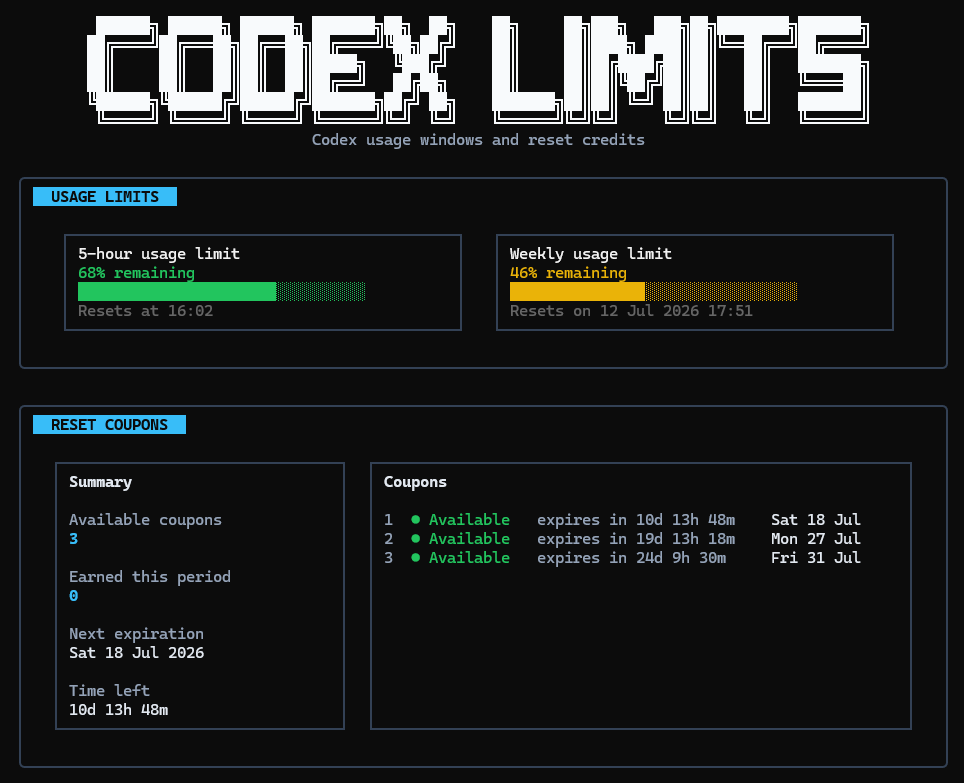
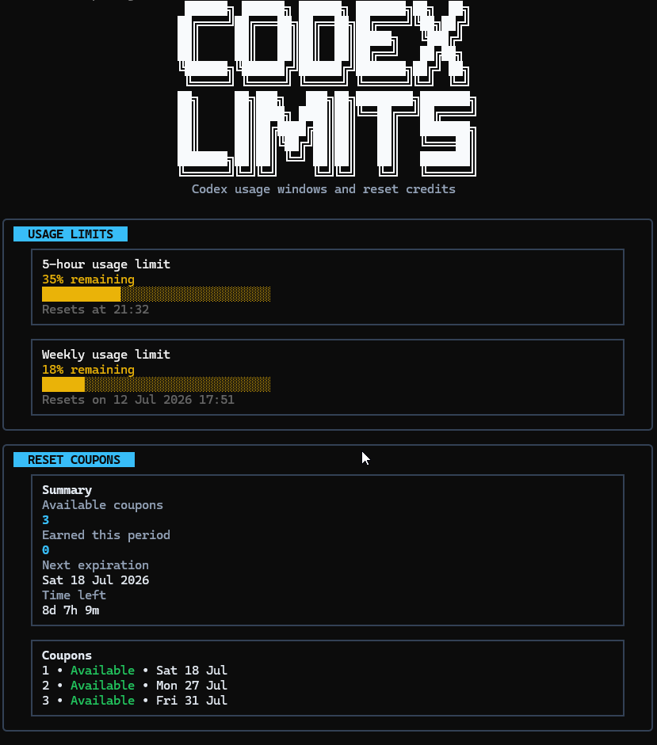
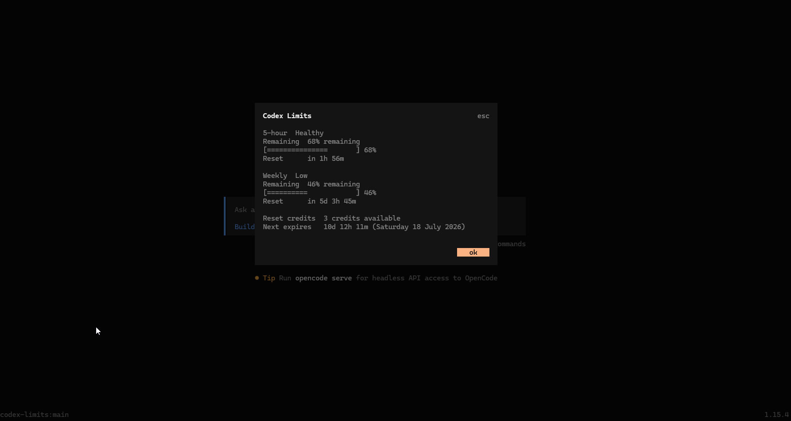
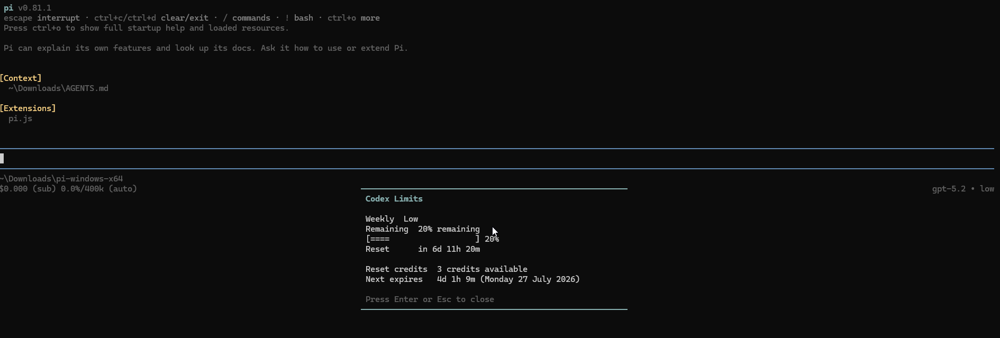
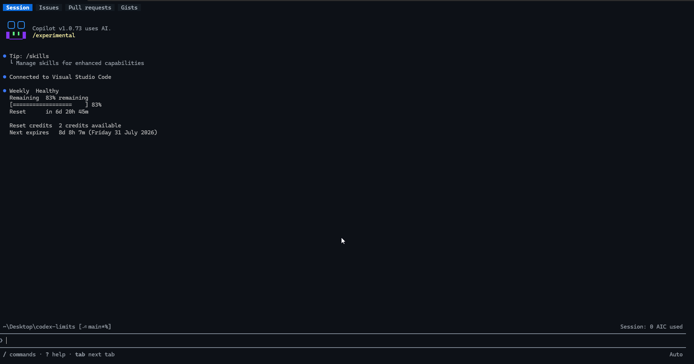

<h1 align="center">
  
</h1>

<p align="center">
  <strong>Monitor OpenAI Codex usage limits, reset times, and reset-credit coupons directly from your terminal.</strong>
</p>

<p align="center">
  <a href="#requirements">Requirements</a> · <a href="#quick-start">Installation</a> · <a href="#usage">Commands</a>
</p>

<p align="center">
  <a href="https://github.com/simonesiega/codex-limits/stargazers"></a>
  <a href="https://github.com/simonesiega/codex-limits/issues"></a>
  <a href="https://github.com/simonesiega/codex-limits/pulls"></a>
  <a href="https://github.com/simonesiega/codex-limits/commits/main"></a>
  <a href="LICENSE"></a>
</p>

<p align="center">
  
  <a href="https://www.npmjs.com/package/@simonesiega/codex-limits">
    
  </a>
  <a href="https://github.com/simonesiega/codex-limits/actions/workflows/check.yml?query=branch%3Amain"></a>
</p>

<p align="center">
  <a href="#local-development">
    
    
  </a>
</p>

## Preview 🚀

<p align="center">
  
  
</p>

The screenshots show the **`codex-limits`** terminal dashboards: clean, read-only TUIs that summarize Codex usage limits and reset-credit coupons in one place. The top section displays the usage windows currently supplied by Codex—weekly usage and, when available, the 5-hour window—with remaining percentages, visual progress bars, and reset times, while the lower section shows available reset coupons, their expiration dates, and the next coupon deadline.

## Overview

When you are working with Codex or agent-based coding tools, usage limits can interrupt your flow if you do not know what is left or when the next reset happens.

**`codex-limits`** gives you that information in one clean terminal view. It shows the usage windows currently supplied by Codex, including weekly usage and the 5-hour window when available, together with remaining percentages, progress bars, reset times, and reset-credit coupons, so you can quickly check your status and continue coding without leaving the terminal.

It also includes plain-text commands for quick checks, an explicitly confirmed `codex-limits reset` action for using one reset coupon, a safe `codex-limits doctor` diagnostic report, JSON output for scripts and automation, optional agent integrations through `codex-limits agents`, and safe output that never prints tokens, account IDs, auth headers, cookies, private paths, or raw local files.

## Contents

- [Quick start](#quick-start)
- [Requirements](#requirements)
- [Usage](#usage)
- [Agent integrations](#agent-integrations)
- [How it works](#how-it-works)
- [Environment](#environment)
- [Troubleshooting](#troubleshooting)
- [Documentation](#documentation)
  - [Documentation hub](docs/README.md)
  - [JSON output](docs/readme/json-output.md)
  - [Agent integrations](docs/readme/agent-integrations.md)
  - [Compatibility](docs/readme/compatibility.md)
- [Local development](#local-development)
- [Security](#security)
- [License](#license)
- [Contributors](#contributors)

## Quick start

The package is available on npm as [`@simonesiega/codex-limits`](https://www.npmjs.com/package/@simonesiega/codex-limits). Review the [Compatibility guide](docs/readme/compatibility.md#runtime-and-installation) for the current runtime and installation requirements.

Install **`codex-limits`** globally from npm:

```bash
npm install -g @simonesiega/codex-limits@latest
```

The `@latest` tag ensures you install the latest published version.

Then run it from any terminal:

```bash
codex-limits
```

The list of available commands is shown when you run `codex-limits --help` or in the [Usage](#usage) section.

Optional agent integrations are installed separately. Use the dedicated setup guide for [OpenCode](docs/readme/agents/opencode.md#installation), [pi](docs/readme/agents/pi.md#installation), or [GitHub Copilot CLI](docs/readme/agents/copilot.md#installation).

## Requirements

The canonical [Compatibility guide](docs/readme/compatibility.md) documents supported runtimes, installation methods, operating systems, Codex data, network access, terminals, automation, and agent hosts. Check it before installation or when choosing an optional integration.

## Usage

| Command                                    | Description                                            |
| ------------------------------------------ | ------------------------------------------------------ |
| `codex-limits`                             | Opens the interactive terminal dashboard.              |
| `codex-limits status`                      | Prints a plain usage summary.                          |
| `codex-limits coupons`                     | Prints reset-credit coupon information.                |
| `codex-limits coupons --json`              | Prints machine-readable reset-credit coupon data only. |
| `codex-limits reset <coupon-index>`        | Reviews and uses the numbered available reset coupon.  |
| `codex-limits reset --soonest`             | Reviews and uses the coupon that expires first.        |
| `codex-limits --json`                      | Prints machine-readable usage and coupon data.         |
| `codex-limits doctor`                      | Prints safe environment and connectivity diagnostics.  |
| `codex-limits doctor --json`               | Prints machine-readable diagnostics only.              |
| `codex-limits agents`                      | Lists the available agent-management subcommands.      |
| `codex-limits agents install <agent...>`   | Installs one or more named agent integrations.         |
| `codex-limits agents install --all`        | Installs every supported agent integration.            |
| `codex-limits agents uninstall <agent...>` | Safely removes one or more named agent integrations.   |
| `codex-limits agents uninstall --all`      | Safely removes every recognized agent integration.     |
| `codex-limits init`                        | Runs the compatible interactive installation flow.     |

### Resetting usage

Use one available reset coupon by the number shown in `codex-limits coupons`, or let the command select the available coupon that expires first:

```bash
codex-limits reset <coupon-index>
codex-limits reset --soonest
```

Reset is an irreversible remote mutation and works only in an interactive terminal. The command refreshes the coupon list, prints a recap, and sends the consume request only after an explicit `y` or `yes`; every other answer cancels. If a coupon cannot be selected or the result cannot be confirmed, it does not claim success.

See [Command safety boundaries](SECURITY.md#command-safety-boundaries) for the canonical selection, confirmation, idempotency, and failure-safety behavior.

### Diagnostics

Run the read-only doctor command when Codex data, live usage, or an agent integration is unavailable:

```bash
codex-limits doctor
```

```text
Codex Limits diagnostics

Package version:                1.1.0
Node.js version:                22.0.0
Operating system:               Windows
Codex home detected:            Yes
Authentication found:           Yes
Local usage found:              Yes
Live endpoint:                  Reachable
OpenCode integration:           Installed
pi integration:                 Installed
GitHub Copilot CLI integration: Installed

No sensitive values were displayed.
```

The doctor reports bounded availability statuses for Codex and every registered agent integration. Use `codex-limits doctor --json` for the stable machine-readable form documented in [JSON output](docs/readme/json-output.md#doctor-document), and see the [Security policy](SECURITY.md#local-data-and-network-behavior) for its canonical data-exposure and network safeguards.

### Agent management

Use `codex-limits agents install` and `codex-limits agents uninstall` to manage optional integrations. Both are local-write operations scoped to recognized agent configuration; neither sends a prompt to an LLM or modifies Codex data.

| Command                                                         | What it does                                                                                                       |
| --------------------------------------------------------------- | ------------------------------------------------------------------------------------------------------------------ |
| `codex-limits agents`                                           | Prints help for the agent-management command group.                                                                |
| `codex-limits agents install`                                   | Prompts for every supported integration in an interactive terminal. If none is selected, nothing is installed.     |
| `codex-limits agents install <agent...>`                        | Installs one or more named supported integrations without prompting.                                               |
| `codex-limits agents install --all`                             | Installs every supported integration without prompting.                                                            |
| `codex-limits agents uninstall`                                 | Prompts only for integrations currently recognized as installed. An empty answer keeps each integration installed. |
| `codex-limits agents uninstall <agent...>`                      | Removes recognized Codex Limits configuration for one or more named integrations without prompting.                |
| `codex-limits agents uninstall --all`                           | Attempts safe removal for every registered integration without prompting.                                          |
| `codex-limits agents <action> --help` or `-h`                   | Prints generated help for the selected lifecycle action without changing configuration.                            |
| `codex-limits init --<agent-name>` or `codex-limits init --all` | Preserves the existing initialization syntax as a compatibility installation command.                              |

For either lifecycle action, `--all` cannot be combined with agent names. Duplicate and unknown names, unknown options, and extra positional arguments are rejected before any configuration is changed. In a non-interactive terminal, provide `--all` or at least one agent name. Uninstall reports `not installed` without failing when a selected integration is absent, continues to report each selected agent when another fails, and refuses malformed, symbolic-link, or unrecognized targets rather than rewriting or deleting them.

## Agent integrations

Optional integrations make Codex limit information available directly inside supported coding agents while reusing the same normalized read paths and safety model as the CLI. Agent integrations do not receive the reset command's mutation capability.

For installation details, adapter behavior, architecture, and contribution guidance, see the detailed [Agent integrations guide](docs/readme/agent-integrations.md).

### Supported agents

| Agent              | Status    | Agent command   | Guide                                                       | Description                                                                                      |
| ------------------ | --------- | --------------- | ----------------------------------------------------------- | ------------------------------------------------------------------------------------------------ |
| OpenCode           | Supported | `/codex-limits` | [Setup, usage, and removal](docs/readme/agents/opencode.md) | Opens a fast, read-only dashboard without sending the request or limit data to the LLM.          |
| pi                 | Supported | `/codex-limits` | [Setup, usage, and removal](docs/readme/agents/pi.md)       | Opens a themed, read-only overlay without sending the request or limit data to the LLM.          |
| GitHub Copilot CLI | Supported | `/codex-limits` | [Setup, usage, and removal](docs/readme/agents/copilot.md)  | Logs a compact, read-only timeline summary without sending the request or limit data to the LLM. |

Agent integrations are not enabled automatically during package installation. They must be installed with `codex-limits agents install` (or the compatible `codex-limits init` syntax) and are only available in the agent terminal after a restart. Remove them with `codex-limits agents uninstall`; restart the agent after either lifecycle change. See [Adding new agents](#adding-new-agents) if you want to add support for another agent.

### Selected agent integration screenshots

#### OpenCode

The OpenCode integration adds a `/codex-limits` command that opens a compact modal inside the agent interface. It gives a quick read-only summary of the available usage windows and reset-credit coupons, then lets you close the view and return immediately to the conversation.

<p align="center">
  
</p>

#### pi

The pi integration adds a `/codex-limits` command that opens a themed overlay inside the agent interface. It shows the same read-only usage windows and reset-credit summary without sending the request or limit data to the LLM.

<p align="center">
  
</p>

#### GitHub Copilot CLI

The GitHub Copilot CLI integration adds a `/codex-limits` command that displays a compact, read-only limits summary in the session timeline. It loads the shared core locally without sending the request or limit data to the LLM.

<p align="center">
  
</p>

### Adding new agents

New agents use the same four-file adapter layout under `src/agents/<agent-name>`: `format.ts`, `install.ts`, `integration.ts`, and `plugin.ts`. The integration descriptor owns its metadata, environment help, install, uninstall, and read-only inspection behavior; registering that descriptor in `src/agents/index.ts` automatically connects shared lifecycle commands, compatibility help, and doctor diagnostics. Every registered agent must also use a matching `src/package/<agent-name>.ts` host wrapper and expose `@simonesiega/codex-limits/<agent-name>` through the shared package-entry build. Each integration should show Codex limit information quickly and safely without exposing tokens, account IDs, cookies, auth headers, or raw local files.

See the [Contributing](./CONTRIBUTING.md) guide if you want to add support for another agent.

## How it works

**`codex-limits`** is built around a shared core with different output surfaces on top of it.

| Area               | Path                          | Purpose                                                                                                                                    |
| ------------------ | ----------------------------- | ------------------------------------------------------------------------------------------------------------------------------------------ |
| CLI entry          | `src/package/cli.ts`          | Starts the `codex-limits` command and delegates to the shared command registry.                                                            |
| Agent host entries | `src/package/<agent-name>.ts` | Publish narrow, agent-specific host contracts through one shared package-entry build.                                                      |
| Core logic         | `src/package/core`            | Detects Codex data, normalizes live and local information, performs confirmed coupon redemption, and keeps sensitive values out of output. |
| CLI commands       | `src/package/commands`        | Defines command metadata, shared parsing and help, scoped runtime services, and focused command handlers.                                  |
| Terminal UI        | `src/package/tui`             | Renders the clean Ink-based dashboard from normalized usage data.                                                                          |
| Agent integrations | `src/agents`                  | Contains optional coding-agent adapters used by the `codex-limits agents` command group.                                                   |
| Tests              | `tests`                       | Contains the test suite used to validate core behavior, CLI output, safety rules, and integration logic.                                   |

This structure keeps the project easy to extend: the core owns data meaning and authenticated network operations, while commands control when capabilities are used and the TUI and agents remain rendering-only surfaces.

### Supported package interfaces

For general use and automation, the supported interfaces are the `codex-limits` CLI and its documented [JSON output](docs/readme/json-output.md). The package does not currently expose a general-purpose JavaScript API.

The npm module exports are reserved for supported agent hosts:

| Module specifier                     | Purpose                                                                                   |
| ------------------------------------ | ----------------------------------------------------------------------------------------- |
| `@simonesiega/codex-limits`          | OpenCode plugin entry point retained at the package root for plugin-loader compatibility. |
| `@simonesiega/codex-limits/opencode` | Explicit alias for the same OpenCode plugin module.                                       |
| `@simonesiega/codex-limits/pi`       | Host-only entry point for the bundled pi extension.                                       |
| `@simonesiega/codex-limits/copilot`  | Host-only entry point for the bundled GitHub Copilot CLI extension.                       |

There is intentionally no `@simonesiega/codex-limits/core` export. Files under `src/package/core` are shared implementation details and are not covered by the package's public compatibility contract. The presence of an agent module export does not install or enable that integration; use `codex-limits agents install <agent-name>` for setup.

## Environment

**`codex-limits`** works out of the box when it can find the required Codex data automatically. By default, it tries to detect the local Codex data directory and discover the information needed to show usage limits and reset-credit coupons. Most users do not need to configure anything manually.

Environment variables are only used as a fallback when automatic discovery is not enough, or when you want to override the default behavior.

| Variable                      | Purpose                                                                                  |
| ----------------------------- | ---------------------------------------------------------------------------------------- |
| `CODEX_LIMITS_HOME`           | Overrides the local Codex data directory before all other candidates.                    |
| `CODEX_HOME`                  | Uses Codex's native home override when `CODEX_LIMITS_HOME` is not set.                   |
| `CODEX_LIMITS_ACCESS_TOKEN`   | Provides an access token for authenticated live usage and reset-credit requests.         |
| `CODEX_LIMITS_ACCOUNT_ID`     | Provides the account ID paired with `CODEX_LIMITS_ACCESS_TOKEN`.                         |
| `CODEX_LIMITS_USAGE_ENDPOINT` | Overrides the live usage endpoint with HTTPS or loopback HTTP for advanced setups/tests. |
| `CODEX_LIMITS_SKIP_INIT`      | Suppresses optional global-install setup guidance from the non-interactive postinstall.  |
| `PI_CODING_AGENT_DIR`         | Overrides pi's global agent configuration directory for integration setup and checks.    |
| `COPILOT_HOME`                | Overrides GitHub Copilot CLI's user configuration and extension directory.               |

### Data access and safety

Local Codex data is always inspected read-only with bounded file, directory, JSONL, and response limits. Credentials, raw files, and private paths are excluded from public output. Live requests require HTTPS, except for loopback HTTP during local testing. Only `codex-limits reset` mutates the remote account, and it requires an interactive recap followed by an explicit `y` or `yes` confirmation. See [`SECURITY.md`](./SECURITY.md#local-data-and-network-behavior) for the complete data-access and network-safety model.

## Troubleshooting

For Codex discovery, authentication, live usage, coupons, permissions, terminal rendering, JSON automation, reset redemption, and agent integration problems, use the complete [Troubleshooting guide](docs/readme/troubleshooting.md).

Start with the read-only `codex-limits doctor` command, then follow the guide for the affected surface.

## Documentation

The [documentation hub](docs/README.md) routes CLI users, automation authors, agent users, and contributors to the appropriate canonical guide.

| Area                   | Canonical guide                                                                                                                                                                                                                                                          |
| ---------------------- | ------------------------------------------------------------------------------------------------------------------------------------------------------------------------------------------------------------------------------------------------------------------------ |
| CLI setup and commands | [Quick start](#quick-start) · [Usage](#usage)                                                                                                                                                                                                                            |
| Troubleshooting        | [Troubleshooting guide](docs/readme/troubleshooting.md)                                                                                                                                                                                                                  |
| Automation             | [JSON output](docs/readme/json-output.md) · [Schemas](docs/schema/) · [Examples](docs/examples/)                                                                                                                                                                         |
| Agent integrations     | [Overview](docs/readme/agent-integrations.md) · [OpenCode](docs/readme/agents/opencode.md) · [pi](docs/readme/agents/pi.md) · [GitHub Copilot CLI](docs/readme/agents/copilot.md)                                                                                        |
| Runtime support        | [Compatibility](docs/readme/compatibility.md)                                                                                                                                                                                                                            |
| Development and safety | [Contributing](CONTRIBUTING.md) · [Code of Conduct](CODE_OF_CONDUCT.md) · [Issue forms](https://github.com/simonesiega/codex-limits/issues/new/choose) · [Pull Request template](.github/pull_request_template.md) · [Security](SECURITY.md) · [Changelog](CHANGELOG.md) |

## Local development

Clone the repository, install dependencies, and run the CLI locally:

```bash
git clone https://github.com/simonesiega/codex-limits.git
cd codex-limits
bun install
bun run dev
```

Useful development commands:

| Command                | Description                                                                     |
| ---------------------- | ------------------------------------------------------------------------------- |
| `bun run dev`          | Runs the CLI in development mode.                                               |
| `bun run check`        | Runs formatting, documentation, types, tests, builds, and package smoke checks. |
| `bun run docs:link`    | Checks local documentation links and heading anchors.                           |
| `bun run docs:schema`  | Validates all JSON Schemas and their external and inline examples.              |
| `bun run docs:check`   | Runs both documentation checks.                                                 |
| `bun run audit`        | Checks the locked dependency graph for known vulnerabilities.                   |
| `bun test`             | Runs the test suite.                                                            |
| `bun run build`        | Builds the package.                                                             |
| `bun run format`       | Formats the repository with Prettier.                                           |
| `bun run format:check` | Checks formatting without changing files.                                       |

## Security

| Operation                 | Reads                                           | Writes                               | Network                                |
| ------------------------- | ----------------------------------------------- | ------------------------------------ | -------------------------------------- |
| `codex-limits`            | Recognized Codex state and bounded session data | Nothing                              | Live usage and coupon endpoints        |
| `status` / `coupons`      | Shared read-only core                           | Nothing                              | When live data is requested            |
| `reset`                   | Current reset coupon list and Codex credentials | One selected remote coupon           | Confirmed reset-credit consume request |
| `doctor`                  | Bounded Codex and agent configuration checks    | Nothing                              | Live usage endpoint when authenticated |
| `agents install` / `init` | Selected agent configuration                    | Updates selected agent configuration | Does not send an LLM prompt            |
| `agents uninstall`        | Selected agent configuration                    | Removes recognized integration state | Does not send an LLM prompt            |

For vulnerability reports and local data safety details, see [`SECURITY.md`](./SECURITY.md).

## License

This project is licensed under the MIT License. See [`LICENSE`](LICENSE).

## Contributors

<p align="center">
  <a href="https://github.com/simonesiega/codex-limits/graphs/contributors">
    
  </a>
</p>
