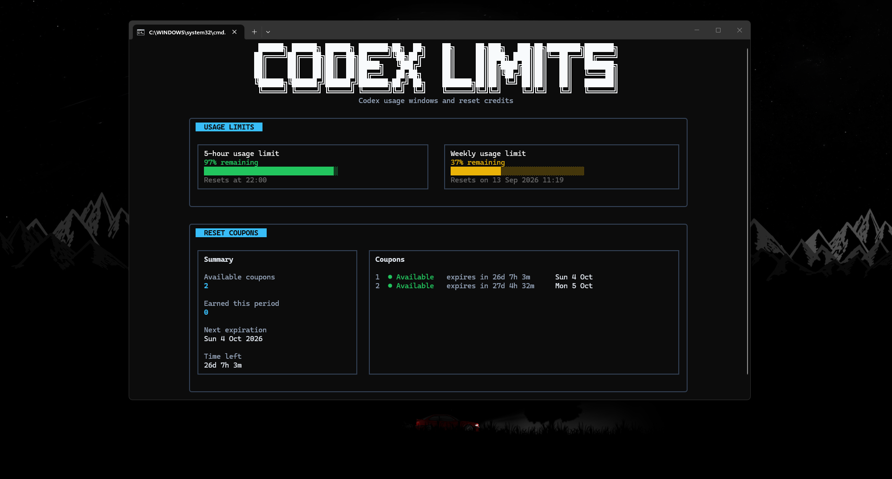
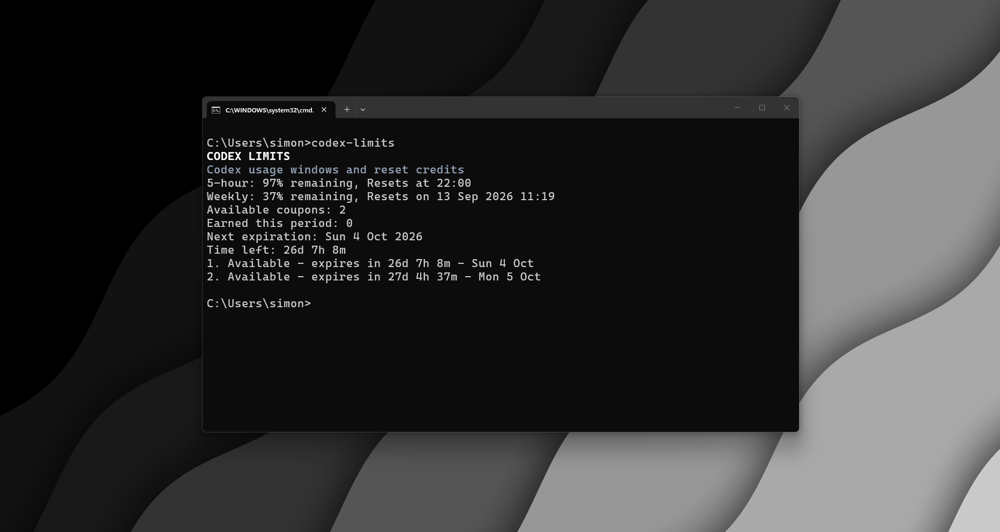
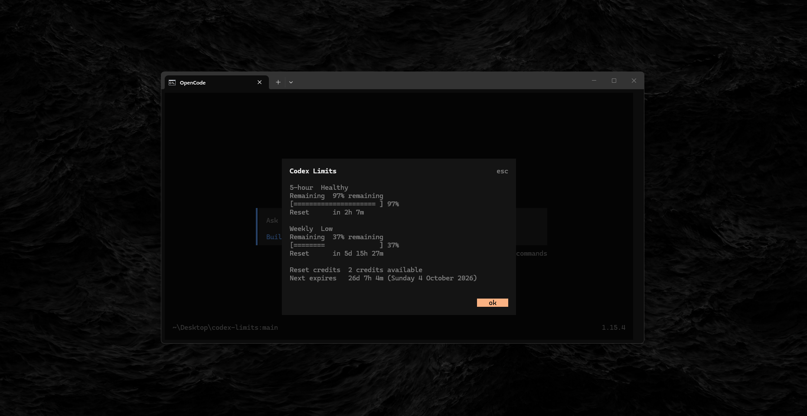

# Codex Limits Showcase

[← Project README](README.md) · [Quick start](README.md#quick-start) · [Agent integrations](docs/guides/agent-integrations.md) · [Documentation hub](docs/README.md)

This page showcases Codex Limits across the interactive dashboard, compact terminal output, and supported coding-agent integrations.

  

  One source of truth, shaped for every terminal workflow.

## Interactive dashboard

  Usage windows, reset times, and available reset credits in one interactive view.

## Compact CLI and agent integrations

<table>
  <tr>
    <td width="50%" valign="top" align="center">
      
    </td>
    <td width="50%" valign="top" align="center">
      
    </td>
  </tr>
  <tr>
    <td valign="top" align="center">
      <strong>Compact CLI</strong> 
      Check the important numbers quickly without opening the full dashboard.
    </td>
    <td valign="top" align="center">
      <strong>Agent integrations</strong> 
      Use the same safe, read-only summary directly inside supported coding agents.
    </td>
  </tr>
</table>

The same underlying Codex limits data is normalized by the shared core and presented differently for each workflow. See [Agent integrations](docs/guides/agent-integrations.md) for OpenCode, pi, and GitHub Copilot CLI setup.

## Showcase media

All showcase media uses sanitized output. Screenshots and recordings must not contain tokens, account IDs, cookies, authorization headers, private paths, environment values, or raw local Codex files.

See the [Security policy](SECURITY.md) for the canonical data-handling and redaction requirements.
